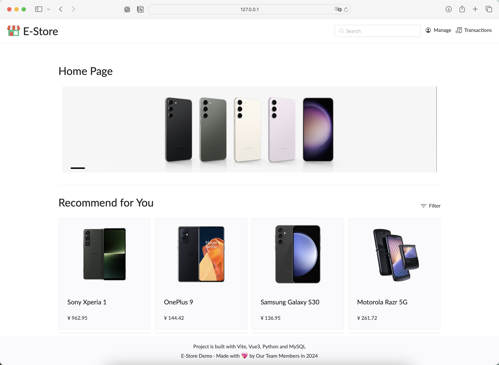

<div align="center">
  
</div>

<div align="center">
    <p>English | <a href="./README_zh_CN.md">简体中文</a></p>
</div>

# COMP 7640 Database Management Group Project


## Project Requirement

Here are some software requirements:

|Name|Minimal Version Required|
|:----:|:----:|
|Python|3.11|
|Node|18.18|
|npm|9.8|
|mysql|8.3|

You may reference other python dependencies in `requirements.txt`

## How to run

+ Clone the repository
```{shell}
git clone https://github.com/parker-int64/comp7640-project
```

+ Initialize a virtual environment
```{shell}
cd comp7640-project
python -m venv venv
```

+ Activate the virtual environment
  - On Unix(MacOS)/Linux 
  ```
  source ./venv/bin/activate
  ```
  - Windows Powershell
  ```
   & .\venv\Scripts\activate
  ```
  - Windows Command Prompt
  ```
  .\venv\Scripts\activate.bat
  ```

+ Install the dependencies
```Shell
pip install -r requirements.txt
```


+ Launch the program

```Shell
python main.py
```

If you encounter problem, you  can also run program in debug mode, that should give more precise output.


## Debug Mode

+ For frontend debug:

```
cd ./Frontend

npm run dev
```

+ For backend debug:

```
cd ./Backend/src

python app_test.py
```